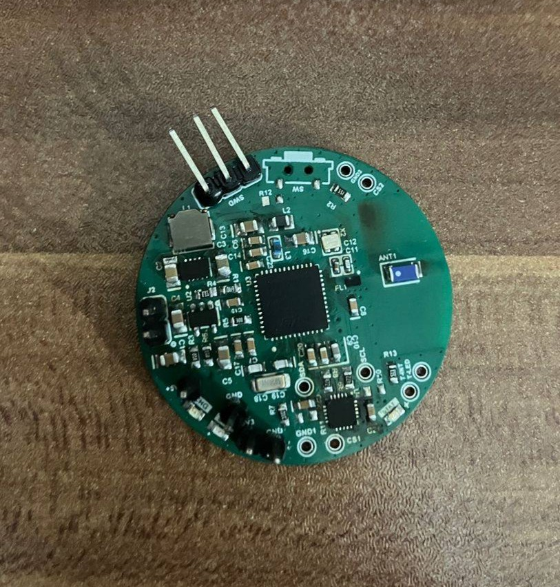
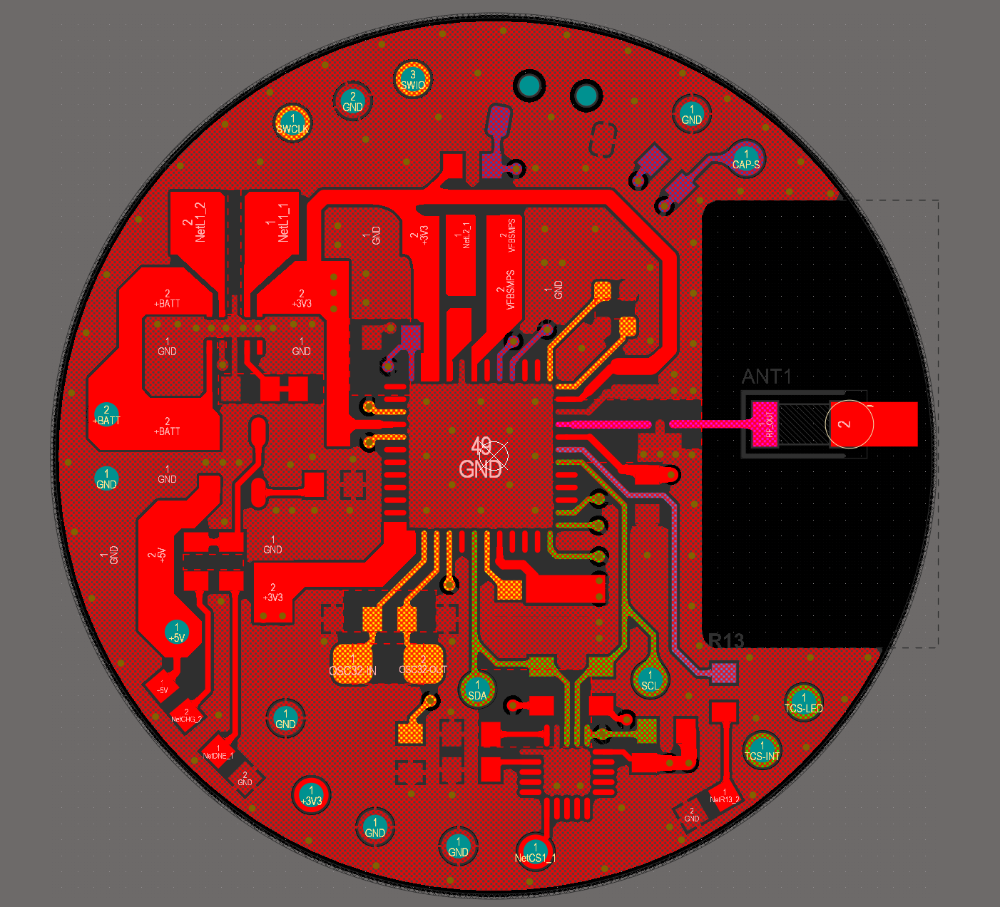
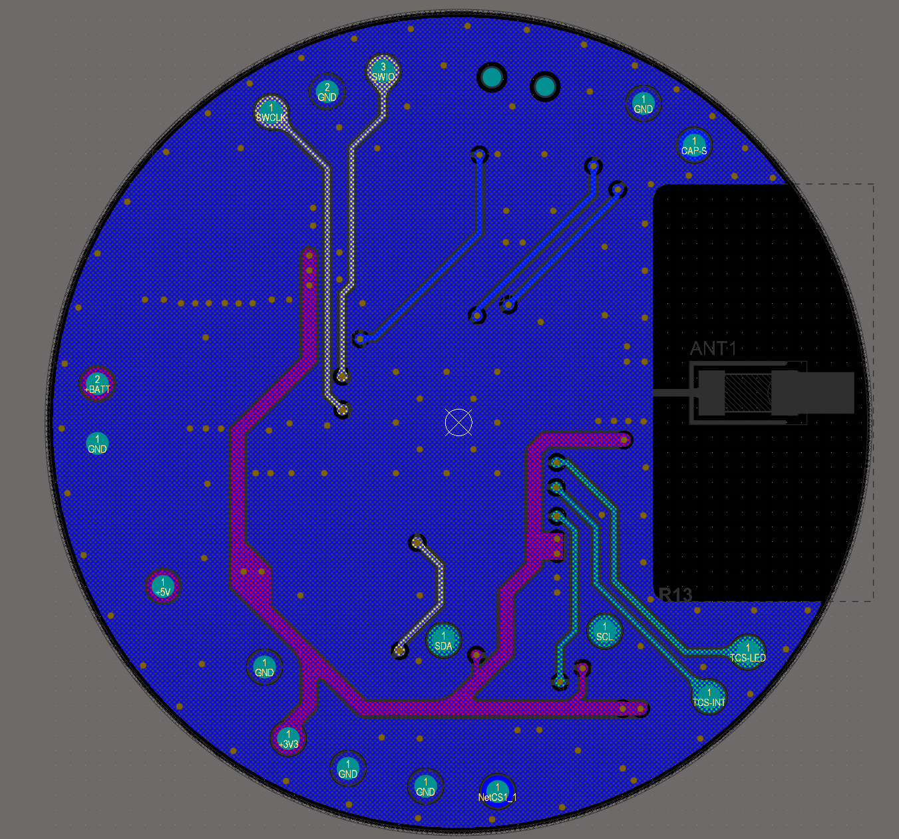
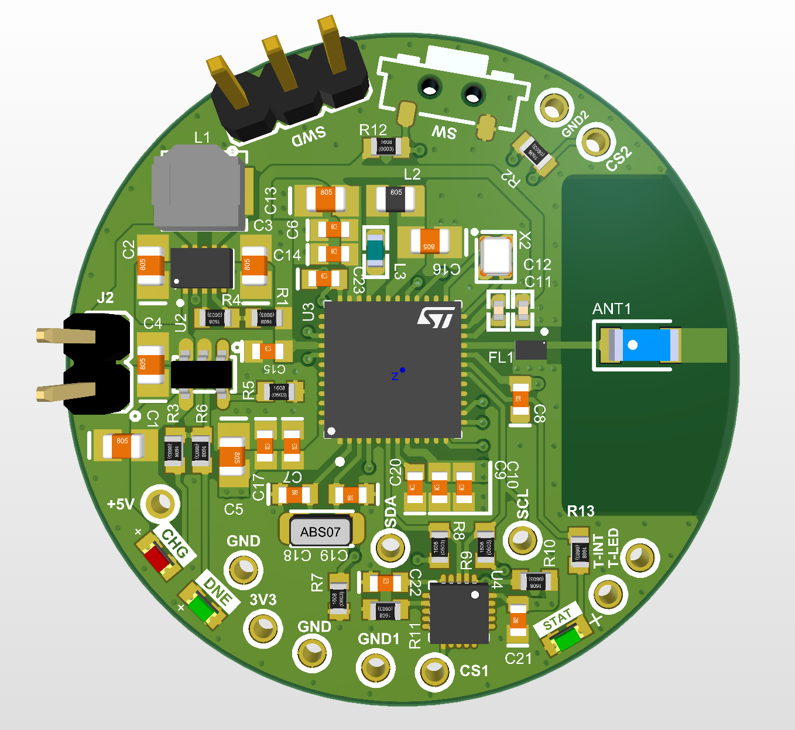

# LittleRF_Hardware

## Overview
This repository contains schematics, PCB design files, and Gerber files for an ultra-low-power Bluetooth Low Energy (BLE) board designed around the STM32WB55CGU6 microcontroller. The board is optimized for minimal power consumption, making it ideal for battery-operated IoT applications.

## Features
- Ultra-low power consumption for extended battery life
- Bluetooth 5.2 Low Energy (BLE) with integrated RF transceiver
- Four-layer PCB for improved signal integrity
- Multiple power modes for efficient energy management
- Single-cell, Li-Ion/Li-Polymer charge management controller with up to 500mA charge current

## Contents
- Schematics: Circuit design files
- PCB Design: Layout files for the board
- Gerber Files: Manufacturing files for PCB fabrication
    - Production files are ready to order frome JLCPCB

 

 

 

